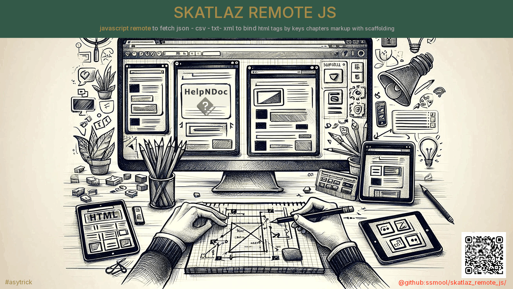

### 🌍 skatlaz_remote_js

JAVASCRIPT REMOTE FETCH TO SCAFFOLDING HTML DOM WITH DATASOURCE FILES JSON-CSV-TXT-RSS-XML



**Version:** 4.0 Beta  
**Status:** Under Development  
**Author:** #asytrick  
**Website:** [github.com/ssmool/skatlaz_remote_js/](https://github.com/ssmool/skatlaz_remote_js/)  
**Contact:** eusmool@gmail.com 

### 🏄 Lightweight JavaScript **remote JSON scaffolder** for HTML DOM.

> Small library to fetch a JSON resource and scaffold values into an HTML template in the browser with minimal client and server memory overhead. Useful for simple content pages, prototyping, and progressive enhancement.

---

## Features

* Fetch JSON from a remote URI and return as a JavaScript object.
* Bind JSON keys to an HTML template and append rendered content into the DOM.
* Tiny footprint and low runtime memory usage — designed for simple pages and constrained environments.
* Easy to extend for parsing CSV, RSS, XML, and plain text for different purposes (#asytrick).

---

## Installation

This is a tiny client-side script. Add the `skatlaz_remote.js` file to your project and include it with a `<script>` tag.

```html
<script src="skatlaz_js.js"></script>
<script src="skatlaz_parser_js.js"></script>
```

---

## API

The library exposes three simple functions:

### `function _set_addr(_path)`

Set the JSON URI to be fetched.

**Parameters**

* `_path` — string URL (relative or absolute) pointing to the `.json` resource.

### `function _skatlaz_remote()`

Fetch the JSON resource previously set with `_set_addr` and return a promise that resolves to the parsed JavaScript object. Internally this uses `fetch()`.

**Returns**

* `Promise<Object>` — resolves to the JSON object.

### `function bind(dom_obj)`

Bind the previously fetched JSON data to the given HTML template DOM element. The `dom_obj` should be an HTML element (for example, created from a template string or selected from the document). The library will look for markers inside the element that match JSON keys (for example `{item_name}`) and replace them with corresponding values.

**Parameters**

* `dom_obj` — an `HTMLElement` which contains one or more markers in its HTML markup.

**Behavior**

* The function will traverse the element's inner HTML for placeholders wrapped in curly braces like `{key}` and substitute values from the JSON.
* If a key corresponds to an array, you can design the template to repeat elements (see example).
* After binding, the result will be appended to the DOM (default behaviour).

---

## Example

Suppose `data.json` looks like this:

```json
{
  "items": [
    {"item_name": "First"},
    {"item_name": "Second"},
    {"item_name": "Third"}
  ]
}
```

And the HTML page contains a script block that defines a template and uses the library:

```html
<!doctype html>
<html>
  <head>
    <meta charset="utf-8">
    <title>skatlaz_remote example</title>
  </head>
  <body>
    <ul id="list">
      <li>{item_name}</li>
    </ul>
    <script src="skatlaz_js.js"></script>
    <script>
      _set_addr('data.json');
      _skatlaz_remote();
      bind(list);      
    </script>
    <script src="skatlaz_parsers_js.js"></script>
    <script>
    //if can use csv, xml, txt, tss, let go to next:
    _set_addr('data.csv');
    _set_data(_data);
    _skatlaz_remote();
    _json = streamCSV();
    #the same steps let be to next others files types to parser to json by use bind() 
    streamTXT();
    streamXML();
    streamRSS();
    </script>

  </body>
</html>
```

In this example the library is used to fetch `data.json`, then each `item` is bound into the template and appended.

---

## Design notes (memory & performance)

* The library is intentionally minimal: it uses streaming-friendly browser APIs (`fetch`) and performs simple string substitutions to avoid creating large intermediate structures.
* For large datasets prefer server-side pagination or incremental loading (fetch smaller JSON pages) to keep client memory low.
* The binding algorithm is string-based and avoids heavy virtual DOM operations; this makes it useful for static-like pages and low-resource clients.

---

## Extensions & parsing other formats (#asytrick)

While the core focuses on JSON, the same scaffolding idea can be expanded:

* **CSV** — parse CSV rows into arrays of objects and feed into `bind()`.
* **RSS / XML** — fetch XML and transform it into a lightweight JSON-like structure before binding.
* **TXT** — simple text formats can be split and mapped to fields.

These parsers can be implemented as separate adapters that transform data into the basic JSON shape the binder expects. The `#asytrick` approach refers to asynchronous, tiny adapters that run client-side (or server-side) to convert data on-the-fly with minimal overhead.

## MANUAL AND EXAMPLE:

READ MORE:

MANUAL JAVASCRIPT REFERENCE *SKATALAZ REMOTE JS:

[SKATLAZ REMOTE JS MANUAL REFERENCE](./manual.md)

HTML EXAMPLE AND JAVASCRIPT FOR *SKATALAZ REMOTE JS:

[SKATLAZ REMOTE JS EXAMPLE](./example.md)

---

---

## Contributing

Contributions are welcome. Keep enhancements small and focused to preserve the library's low-memory goals. Please open issues and PRs on the repository.

---

## License

CREATIVE COMMONS ZERO
---

## Repository & Contact

Repository: `https://github.com/ssmool/skatlaz_remote_js/`

Contact: [eusmool@gmail.com](mailto:eusmool@gmail.com)

---

*Made with 💡 — skatlaz_remote_js*
